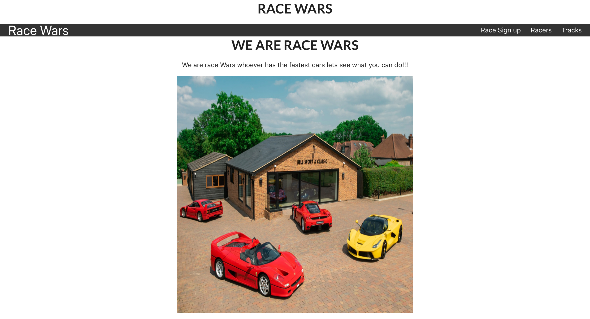
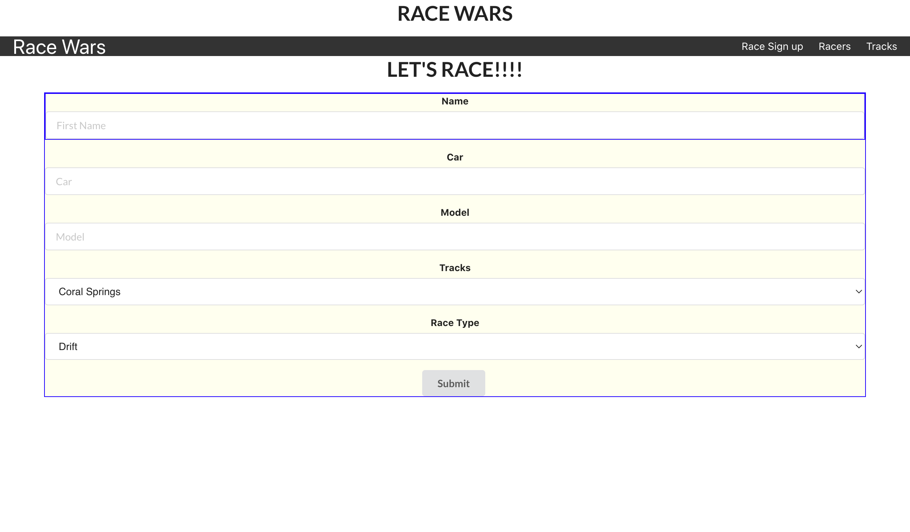

# race-wars

## Date: 07/25/2022

### By: Roshawn Brooks

---

### Description

The user maybe able to sign up and join a certain race of there choice. they would be able to pull out of a race or see the current competition line up. Racers and no racers maybe able to view the diffrent tracks in the race day.

### Technologies Used

- React
- React Router
- CSS
- Javascript
- Express / Node JS
- Mongoose
- MongoDB

---

### How to get started

Fork and clone the repository. In the client folder and main folder run npm i to download all needed dependencies. Go to MongoDB and start a new cluster, take your personal DB url and connect it in db index file

### [TrelloBoard](https://trello.com/b/njMskdlx/racing-meet)

---

### Sources

### [MarkDown](https://www.markdownguide.org/cheat-sheet/)

# 

# 

### [ERD](https://viewer.diagrams.net/?tags=%7B%7D&highlight=0000ff&edit=_blank&layers=1&nav=1&title=full%20stack%20app#R7ZhLc9owEIB%2FDcd2LD8gHBsgyUybSRrIkJw6Aiu2WlvLyOKVX18Jy29TO4SETNsLSCtpJe1%2B3l27Yw3CzSXHC%2F8aXBJ0TMPddKxhxzQd1JW%2FSrCNBaiHerHE49TVskwwps9ECw0tXVKXRIWJAiAQdFEUzoExMhcFGeYc1sVpTxAUd11gj1QE4zkOqtIpdYUfS8%2FMXia%2FItTzk51Rtx%2BPhDiZrG8S%2BdiFdU5kjTrWgAOIuBVuBiRQxkvsEq%2B72DOaHowTJtosmE6nV18hdPvOWrjO99EPg9x%2F0lpWOFjqCw8gXBBBBQXWMbuBVH0%2B47Ll7Vo4otI2wVa5wSfy14eQJGY0jWVEmacsr1xOGPAQB9KlrupioaRhTEgXhwupj80i9VfdSJtMbBM%2FcFgyl6irGHJ47VNBxgs8V6NrSZ6U%2BSIMZA%2Blq1eEC7LZay2U%2BkDCS%2BQ1BFfX0gvMvh0vWWdeR4kr%2FZzHu1qGNWheqirzhWxod7zANWbFNRWjPAET%2BpFBZtEEhLlfFP6yO7p7JhwmcI3ZNh65oEEyr2hXsqHiQbU%2FO7r3mOiT7eEmN2241Z34VMStPEclU8uTw5LPSRONVZfkXWDUuCAVchJgQVfFg9Q5Ru9xC1QeMfW5hfSzmwQrp%2BTb%2BAJ6Vf5RKyty7IKiNJoligTmHhEVRTtO0osfjo7djI7y11h3pZ%2Bo2N7tjAdslI2ctwUsxMy9YaTKE5MXech3HjO6VDdDatd7OVOxJT8uU6ZlFJmyDmUKFRWZZUVvzNTZ8cIRMJJGo0geW5QjVS1KwWw3R0V1lYOUKMcwcOGDBwwHeX7nS77aaUAvgOovgAV1S7C8cwBKtjtFBCoRtTc01fCURCv0r0Yrp1%2Fixj40WpVJLpdJbw1gtbC9k9Vi1Fx53t6MJxVW37v6TCvN8vN7smoUVcvRIZeg8ahqwsvRRG1mGrf3pzdlWsh%2FHFNaFVNOOJ7%2Fik5uK7v34bCz%2F5g3GNRE9qwU%2BAaw0Nb5SYTY6kSClwJKqUS%2F9yTtXNzf%2B95Tny1QQ66oSTvt00fzC5TVNs9Y9SC0zh%2Bv86rTXB4coZjMDzUn%2F9cg8GavN80eb11ZmKctLRorgralhV1S9N6VRfd47Ia12IZtiT2QvkNIPyax5itj1H9iE2JlN%2Ft%2BHE%2FPvsJbo98%3D)

### [Component Flow](https://lucid.app/lucidchart/2af5f567-4668-48aa-9834-b16d0511d6af/edit?invitationId=inv_6b857c88-d916-41a5-aca2-0719e75a2f8a#)

---

## Try Game
